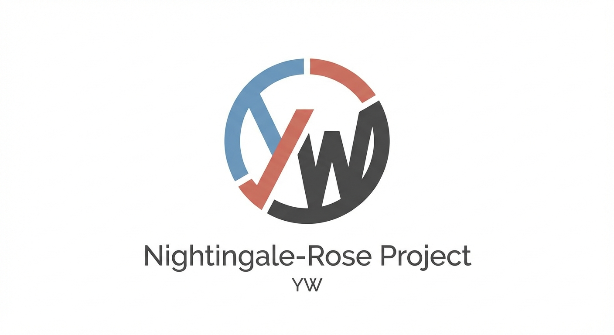

# Florence Nightingale's Rose Diagram — A Replication



## The Story

Florence Nightingale, the founder of modern nursing, was also a pioneering data visualizer. During the Crimean War (1853-1856), she collected mortality data from British military hospitals and created her famous "rose diagram" (also called a coxcomb chart) to demonstrate that most soldier deaths were caused by preventable diseases rather than battle wounds. Her compelling visual evidence helped convince the British government to implement crucial sanitary reforms, ultimately saving countless lives and establishing data visualization as a powerful tool for social change.

## How the Data Was Collected

I developed a custom Python application (`Florence_Nightingale_Rose_Diagram.py`) to digitize coordinates from Nightingale's original rose diagram. The app allows users to:
- Load the historical diagram image
- Mark precise pixel coordinates for each wedge boundary by placing colored dots (red, blue, black, and origin)
- Save coordinate groups for each month and cause of death
- Export all coordinates to JSON format

After collecting the pixel coordinates, I calculated the distance from the origin point to each boundary point to determine the radius of each wedge. Since the area of each wedge is proportional to the square of its radius (A ∝ r²), I was able to compute the relative death counts represented by each colored section of the diagram.

## The Math and Visualization

The rose diagram uses polar coordinates where:
- Each wedge represents one month of data
- The radius (distance from center) encodes the magnitude of deaths
- Area is proportional to r², making visual comparisons possible
- Different colors represent different causes of death:
  - Blue: Deaths from preventable diseases (wounds and other causes)
  - Red: Deaths from wounds in battle
  - Black: Deaths from all other causes

The diagram is split into two parts: deaths before sanitary reforms (right side) and deaths after reforms (left side).

## The Visualization


## Key Insights

- **Before reforms (right diagram):** The blue wedges dominate, showing that preventable diseases caused far more deaths than battle wounds, with peaks during winter months reaching catastrophic levels.
- **After reforms (left diagram):** The overall area is dramatically reduced, with blue sections shrinking significantly, demonstrating the life-saving impact of improved sanitation and hospital conditions.
- **Policy impact:** Nightingale's visualization proved that data-driven evidence could drive policy change—her diagram made the invisible visible and turned statistics into a compelling argument for reform.
- **Design innovation:** By using area rather than simple bar heights, Nightingale created a more emotionally impactful visualization that made the scale of preventable deaths impossible to ignore.

## Technical Details

- **Language:** Python 3.x
- **Libraries:** 
  - `tkinter` - GUI framework for the digitization app
  - `PIL/Pillow` - Image loading and display
  - `json` - Data persistence
  - `matplotlib` - Rose diagram plotting (plotting script to be developed)
  - `pandas` - Data manipulation
  - `numpy` - Mathematical calculations
  
- **Files:**
  - `Florence_Nightingale_Rose_Diagram.py` - Interactive coordinate digitization application
  - `coordinate_groups_export.json` - Saved coordinate data from digitization
  - `data/Nightingale-mortality.jpg` - Source image (historical diagram)
  - `src/plot_rose.py` - Rose diagram generation script (to be developed)
  - `data/nightingale_computed.csv` - Processed data with calculated radii and areas

## How to Run

### Digitization App

1. Clone this repository
2. Create and activate a virtual environment (optional):
   ```bash
   python -m venv venv
   source venv/bin/activate  # On Windows: venv\Scripts\activate
   ```
3. Install requirements:
   ```bash
   pip install pillow
   ```
4. Run the digitization app:
   ```bash
   python Florence_Nightingale_Rose_Diagram.py
   ```
5. Use the app to:
   - Open the Nightingale diagram image
   - Press `4` to set origin point at the center
   - Press `1`, `2`, `3` to mark wedge boundaries (red, blue, black dots)
   - Save coordinate groups with descriptive names
   - Export all data when complete

### Plotting Script

(To be developed)
```bash
python src/plot_rose.py
```

## What I Learned

This project taught me that historical data visualization required the same careful attention to precision that modern work does—extracting coordinates from a 160-year-old diagram demanded both technical skill and historical understanding. I gained hands-on experience building interactive GUI applications with Tkinter, managing complex state across user interactions, and thinking about how to make data collection tools intuitive and robust. Most importantly, I learned that great data visualization isn't just about making pretty pictures; Nightingale's rose diagram shows how the right visualization at the right time can literally change the world by making invisible patterns visible and turning abstract numbers into compelling arguments for action.

## References

- Nightingale, F. (1858). *Notes on Matters Affecting the Health, Efficiency, and Hospital Administration of the British Army*
- [Florence Nightingale's Statistical Diagrams](https://www.sciencemuseum.org.uk/objects-and-stories/florence-nightingale-pioneer-statistician) - Science Museum, London
- [The Rose Diagram: A Historical Analysis](https://www.florence-nightingale-avenging-angel.co.uk/Coxcombs.pdf)
- [Understanding Polar Area Diagrams](https://datavizcatalogue.com/methods/polar_area_chart.html)
